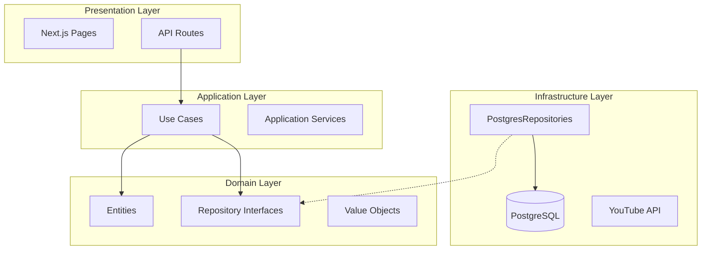

<p align="center">
  
  
  
  
  
</p>

<h1 align="center">Atonix • CronoStudio</h1>

<p align="center">
  <strong>Suite de producción para creadores de contenido</strong><br>
  Local-first SaaS • Dashboard • Automation • Analytics
</p>

<p align="center">
  <a href="#-sobre-el-proyecto">Proyecto (ES)</a> •
  <a href="#-project-overview">Project (EN)</a> •
  <a href="#-documentación">Docs</a> •
  <a href="#-roadmap">Roadmap</a>
</p>

> Estado operativo y handoff IA: ver `docs/OPENCLAW_HANDOFF.md`.

---

## 📋 Tabla de Contenidos (ES)

- [Sobre el Proyecto](#-sobre-el-proyecto)
- [Características Principales](#-características-principales)
- [Tecnologías Utilizadas](#-tecnologías-utilizadas)
- [Arquitectura](#-arquitectura)
- [Seguridad](#-seguridad)
- [Instalación](#-instalación)
- [Documentación](#-documentación)
- [Mejores Prácticas](#-mejores-prácticas)
- [Roadmap](#-roadmap)
- [Contribuir](#-contribuir)

---

## 🎯 Sobre el Proyecto

**CronoStudio** es el producto de Atonix para creadores de YouTube. Ofrece un dashboard unificado para gestionar el flujo completo de producción (idea → guion → edición → publicación), con automatización interna en workers Go y analíticas en tiempo real.

### ¿Por qué este proyecto?

- **Local-first real**: tus datos permanecen en tu entorno.
- **Pipeline claro**: control del proceso completo sin improvisación.
- **Automatización confiable**: flujos de sync y analytics listos.
- **Multi-canal**: gestión centralizada de varios canales.

---

## 🚀 Características Principales

| Módulo | Descripción | Estado |
|--------|-------------|--------|
| 🏠 **Dashboard** | Vista general del pipeline y prioridades | ✅ Ready |
| 💡 **Ideas** | Banco de ideas con evaluación IA | ✅ Ready |
| 📝 **Producción** | Pipeline completo (guion → edición) | ✅ Ready |
| 📺 **Canales** | Gestión multi-canal y métricas | ✅ Ready |
| 🔐 **Seguridad** | JWT, rate limiting, validación Zod | ✅ Ready |
| 🤖 **Automatización** | Workers internos Go + colas | ✅ Ready |

---

## 🛠 Tecnologías Utilizadas

### Frontend
- **Next.js 16.1.x** (App Router)
- **TypeScript** (Strict Mode)
- **Tailwind CSS** (Styling)
- **Framer Motion** (Animations)
- **Lucide React** (Icons)

### Backend
- **Next.js API Routes**
- **PostgreSQL 16**
- **JWT** (Stateless Auth)
- **Zod** (Validation)

### Infraestructura
- **Docker Compose**
- **Go Workers** (internal automation)
- **Vitest** (Unit Testing)

---

## 🏗 Arquitectura

CronoStudio sigue una **Clean Architecture** estricta para garantizar mantenibilidad y escalabilidad.



Ver [ARCHITECTURE.md](docs/ARCHITECTURE.md) para flujos críticos.

---

## 🔒 Seguridad

- **Auth**: JWT + refresh tokens.
- **Validación**: Zod en rutas críticas.
- **Rate Limiting**: Redis/memoria.
- **Headers**: CSP report-only, CORS explícito.
- **Tokens**: OAuth YouTube con refresh automático.

Ver [SECURITY.md](docs/SECURITY.md).

---

## 🚀 Instalación

1. **Clonar**
   ```bash
   git clone https://github.com/NaktoG/cronostudio.git
   cd cronostudio
   ```
2. **Setup local (recomendado)**
   ```bash
   make start
   ```
3. **Alternativa manual**
   ```bash
   cp infra/docker/.env.example infra/docker/.env
   cp apps/web/.env.example apps/web/.env.local
   ./scripts/migrate.sh
   cd apps/web && npm install && npm run dev
   ```

---

## 📚 Documentación

- [OpenClaw Handoff (estado actual)](docs/OPENCLAW_HANDOFF.md)
- [Índice de docs](docs/INDEX.md)
- [Setup](docs/SETUP.md)
- [Runbook](docs/RUNBOOK.md)
- [Arquitectura](docs/ARCHITECTURE.md)
- [Automation Data Model](docs/automation/DATA_MODEL.md)
- [Queue + Retries + DLQ](docs/automation/QUEUE_RETRIES_DLQ.md)
- [Seguridad](docs/SECURITY.md)
- [Observabilidad](docs/OBSERVABILITY.md)
- [Deploy y Cutover](docs/DEPLOY_AUTOMATION.md)
- [Roadmap](docs/ROADMAP.md)
- [Contributing](CONTRIBUTING.md)

---

## ✅ Mejores Prácticas

- **Clean Architecture**: separación estricta de responsabilidades.
- **SOLID** aplicado en backend.
- **Validación Zod** en inputs críticos.
- **Rate limiting** en endpoints sensibles.
- **Observabilidad** lista para producción.

---

## 🗺 Roadmap

Ver [ROADMAP.md](docs/ROADMAP.md) (Now / Next / Later).

---

## 🤝 Contribuir

Ver [CONTRIBUTING.md](CONTRIBUTING.md).

---

## 🌍 Project Overview (EN)

**CronoStudio** is Atonix's production suite for YouTube creators. It provides an end‑to‑end pipeline (idea → script → edit → publish) with automation and analytics built‑in.

### Why this project?

- **Local-first**: your data stays in your environment.
- **Clear pipeline**: consistent production without improvisation.
- **Automation**: ready-to-run sync + analytics workflows.
- **Multi‑channel**: manage multiple channels from one place.

---

## 🚀 Key Features (EN)

- Dashboard with priorities and weekly status
- Ideas bank with AI evaluation
- Full production pipeline
- Multi‑channel management
- OAuth YouTube + analytics sync
- internal automation workers

---

## 🛠 Tech Stack (EN)

- Next.js 16 (App Router)
- TypeScript (strict)
- Tailwind CSS
- PostgreSQL 16
- internal automation

---

## 📚 Docs (EN)

- [Docs Index](docs/INDEX.md)
- [Architecture](docs/ARCHITECTURE.md)
- [Security](docs/SECURITY.md)
- [Roadmap](docs/ROADMAP.md)

---

<p align="center">
  Made with ❤️ by <strong>Atonix</strong><br>
  CronoStudio © 2026
</p>
