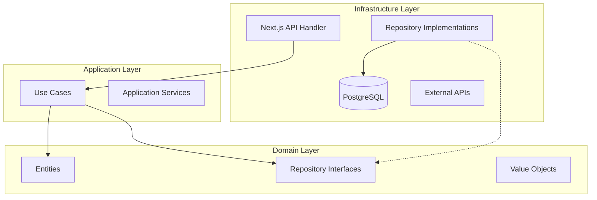

# 🏗 Arquitectura del Sistema

CronoStudio sigue una arquitectura modular en capas (**Clean Architecture**) para garantizar la separación de responsabilidades, testabilidad y mantenibilidad a largo plazo.

## 📐 Diagrama de Capas

## 🧩 Descripción de Capas

### 1. Domain Layer (Núcleo)
Es el corazón de la aplicación. No tiene dependencias externas.
- **Entities**: Objetos de negocio con identidad única (`Idea`, `Production`, `User`).
- **Value Objects**: Objetos inmutables definidos por sus atributos (`IdeaStatus`, `Email`).
- **Repository Interfaces**: Contratos que definen cómo se accede a los datos, sin implementar la lógica.

**Ubicación:** `src/domain/`

### 2. Application Layer (Casos de Uso)
Contiene la lógica de negocio específica de la aplicación. Orquesta las entidades y los repositorios.
- **Use Cases**: Ejecutan acciones específicas (`CreateIdeaUseCase`, `ListProductionsUseCase`).
- **Services**: Servicios transversales puramente de lógica (`AuthService`).

**Ubicación:** `src/application/`

### 3. Infrastructure Layer (Implementación)
Implementa las interfaces definidas en el dominio y maneja detalles técnicos.
- **Repository Implementations**: Implementaciones concretas usando PostgreSQL (`PostgresIdeaRepository`).
- **External Services**: Clientes para APIs externas (YouTube, OpenAI).

**Ubicación:** `src/infrastructure/`

### 4. Presentation Layer (Web/API)
Punto de entrada de la aplicación.
- **API Routes**: Handlers de Next.js que reciben HTTP requests y llaman a los Use Cases.
- **UI Components**: Componentes React.

**Ubicación:** `src/app/api/` y `src/app/(routes)/`

---

## 🔄 Flujo de Datos

1. **Request**: `POST /api/ideas` recibe un JSON.
2. **Controller**: `route.ts` valida el input con **Zod** y extrae el User ID (AuthService).
3. **Use Case**: Se instancia `CreateIdeaUseCase` inyectando `PostgresIdeaRepository`.
4. **Domain Logic**: El Use Case crea una entidad `Idea` usando una factory function.
5. **Persistence**: El repositorio guarda la entidad en PostgreSQL.
6. **Response**: Se retorna la entidad creada como JSON.

---

## 🛡 Principios SOLID Aplicados

- **Single Responsibility Principle (SRP)**: Cada Use Case hace una sola cosa.
- **Open/Closed Principle (OCP)**: Las entidades están cerradas a modificación pero abiertas a extensión.
- **Liskov Substitution Principle (LSP)**: Las implementaciones de repositorios son intercambiables.
- **Interface Segregation Principle (ISP)**: Interfaces de repositorios granulares.
- **Dependency Inversion Principle (DIP)**: Los Use Cases dependen de interfaces (Domain), no de implementaciones (Infrastructure).
